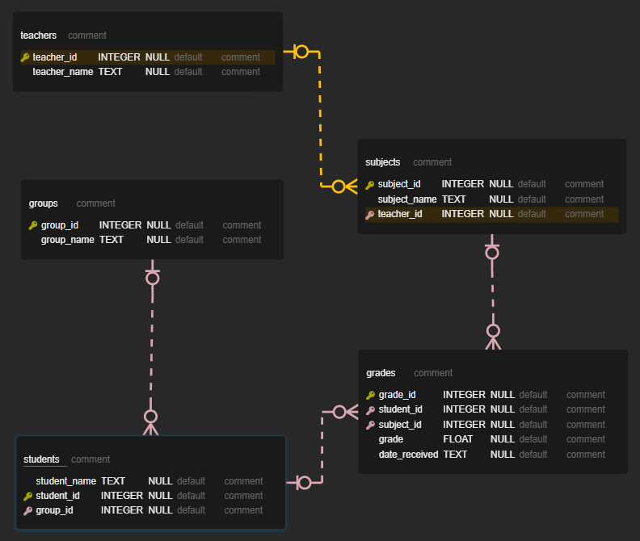
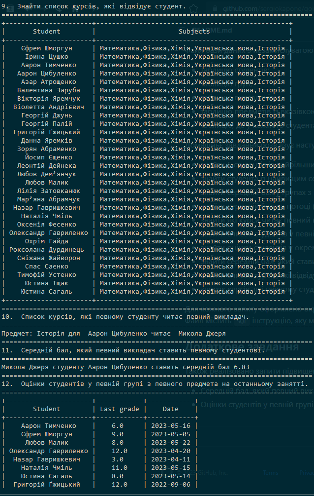

# Домашнє завдання #6  

## Основне завдання

Файл бази даних з незамислуватою назвою `database.db` містить:

- таблицю студентів;
- таблицю груп;
- таблицю викладачів;
- таблицю предметів із вказівкою викладача, який читає предмет;
- таблицю, де у кожного студента є оцінки з предметів із зазначенням коли оцінку отримано.

Домашньє завдання розв'язує наступні задачі:

- знайти 5 студентів із найбільшим середнім балом з усіх предметів.
- знайти студента із найвищим середнім балом з певного предмета.
- знайти середній бал у групах з певного предмета.
- знайти середній бал на потоці (по всій таблиці оцінок).
- знайти які курси читає певний викладач.
- знайти список студентів у певній групі.
- знайти оцінки студентів у окремій групі з певного предмета.
- знайти середній бал, який ставить певний викладач зі своїх предметів.
- знайти список курсів, які відвідує студент.
- зписок курсів, які певному студенту читає певний викладач.

Для кожного запиту оформлено окремий файл `query_number.sql`, де `number` підставити є номером запиту. Файл містить `SQL` інструкцію,
яку можна виконати як у терміналі бази даних, так і через `cursor.execute(sql)`.

## Додаткове завдання

Також реалізовано запити підвищеної складності (файли `query_11.sql` та `query_12.sql`):

- Середній бал, який певний викладач ставить певному студентові.
- Оцінки студентів у певній групі з певного предмета на останньому занятті.

## ERD діаграма[^1]

[^1]: Діаграма побудована за допомогою плагіну [ERD Editor](https://marketplace.visualstudio.com/items?itemName=dineug.vuerd-vscode) для VSCode

## Вигдяд програми

## Довідкові матеріали

- [Довідник по SQL](https://code.mu/ru/sql/manual/)
- [Додатковий курс по SQL від GoIT](https://goit.global/textbooks/mysql-qhg4na/v1/docs/)
